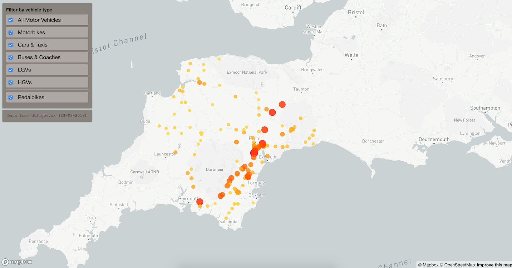

# Road Traffic Visualisation in Mapbox GL
[View live app here](https://rtv.bhison.now.sh/)

#### Overview
Traffic data (*downloaded from the [UK Department of Transport](https://roadtraffic.dft.gov.uk/api/average-annual-daily-flow-by-direction?filter[local_authority_id]=71) on 28th August 2019*) sits locally in JSON form, is read in and converted to GeoJSON. Upon different filtering options being selected, different totals are fed to set the circle colour and size for each point. These are normalised against the highest count under the current filtering options.

_**Note:** data is stored locally rather than fetched from the API as the endpoint response doesn't have a header which creates CORS issues_

#### Unimplemented ideas
- Ability to break down information by direction
- Ability to further break down HGV vehicle types
- d3 graph to show most common type of road to travel down for each vehicle type. You can see the positioning
  of the bar chart by removing the 'hidden' class from the relevant div in index.html